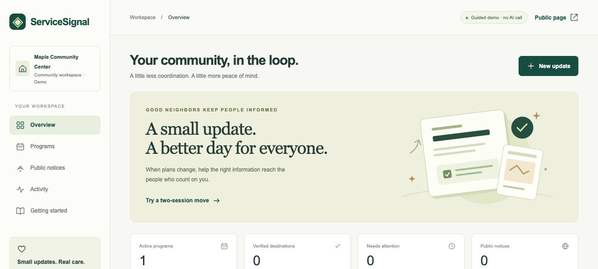

# ServiceSignal

**When a community program changes, approve the correction once. Update connected notices and see what still needs attention.**

A working application with a fictional demo and an authenticated pilot mode for the **Agents for Humans · Good Neighbor Agents** track. ServiceSignal helps a community-center coordinator manage temporary class changes across an owned website, printable notices, partner-owner follow-up, and printed-copy tasks. Partner simulation is available only in demo mode.

[Hosted pilot](https://servicesignal-production.up.railway.app) · [Source repository](https://github.com/ankitlade12/servicesignal-agents-for-humans) · [Narrated guided walkthrough](artifacts/guided-walkthrough.mp4) · [Submission readiness](docs/SUBMISSION.md)



## Run locally

Requires Python 3.12–3.14 and [uv](https://docs.astral.sh/uv/). No Node build, database service, or API key is needed for the labeled guided demonstration.

```bash
uv sync --frozen
bash scripts/start.sh
```

Open **http://localhost:8017**. The command starts the API and a separate durable worker. Data persists in `data/servicesignal.sqlite`. Stop with Ctrl+C. A different port can be selected with `SERVICESIGNAL_PORT=8020 bash scripts/start.sh`.

The default `AGENT_PROVIDER=fixture` mode only recognizes the two built-in examples. Other input requires manual fact confirmation. **Fixture mode is not a live Strands run and must not be presented as one.**

## Try the complete story

1. Select **Try a two-session move**, then **Prepare update**.
2. Review the source evidence and exact September 15/22, 2026 sessions. Confirm facts.
3. Approve the exact plan, including the expiration fallback.
4. Watch the website become **Verified** after an actual HTTP write and a separate HTTP read of the rendered page.
5. Open the public page; download the printable PDF and QR code.
6. Simulate partner acknowledgment, publication, or refusal. These states never masquerade as live directory verification.
7. Advance the isolated demo clock to the reminder and expiration. Future arrangements remain unconfirmed until a new update is approved.
8. Export the evidence from Activity. Reset deletes this workspace and invalidates its public link.

Every isolated workspace starts its **demo clock at September 13, 2026**, so the fictional September scenario remains replayable throughout judging. The clock advances normally from there, or through the labeled demo controls. Past changes relative to that demo clock are rejected. Session expiry still uses real elapsed time. These dates never claim current real-world service availability.

## Organization pilot mode

Set `SERVICESIGNAL_MODE=pilot` in `.env` before starting. [Initial owner invitations and cloud setup](docs/HOSTING.md) are available for Railway/Render. An operator provisions the organization owner; there is no public signup.

```bash
PYTHONPATH=. uv run python scripts/manage_accounts.py create-organization \
  --organization "Your organization" --email "owner@example.org" --name "Coordinator name"
```

The command prompts for a password without putting it in shell history. The owner signs in, confirms the program baseline, and can invite editors/viewers and add programs. Only owners approve publication. Invitations are single-use, email-bound links; the app sends no email. Pilot links persist after logout and demo cleanup does not delete pilot data. See the [account and operations runbook](docs/DEPLOYMENT.md). Use fictional information until a consenting organization and its authorized owner are established.

## Live Strands configuration

Use a `.env` file based on `.env.example`, or export environment variables. Never commit keys. The Strands SDK and all transitive dependencies are pinned in `uv.lock`.

### OpenAI through Strands

```bash
export AGENT_PROVIDER=openai
export AGENT_MODEL_ID=gpt-5.4-mini-2026-03-17
# Set a funded OPENAI_API_KEY securely in .env or the server environment.
PYTHONPATH=. uv run python scripts/smoke_agent.py
bash scripts/start.sh
```

Strands provides an [official OpenAI adapter](https://strandsagents.com/docs/user-guide/concepts/model-providers/openai/). This app uses that adapter, including streaming, read-only tools, and structured output. The configured default is [GPT-5.4 mini](https://developers.openai.com/api/docs/models/gpt-5.4-mini); `AGENT_MODEL_ID` is configurable. The [hackathon rules](https://agentsforhumans.devpost.com/rules) require Strands and do not specify a required model provider, so this integration appears compatible. AWS account/Builder ID requirements still apply.

**Live OpenAI through Strands now passes the relocation smoke and all 12 labeled development cases.** Earlier development runs passed 9/12 and 10/12; all results are retained in `artifacts/evaluation*.json`. This is not a held-out benchmark. The actual Strands and OpenAI SDKs pass a local HTTP-fixture contract test, including streamed tool calls, structured proposals, and rejection of fabricated quotations. The fixture test remains separate from the recorded live results. Restart the server after changing provider settings.

### Amazon Bedrock

```bash
export AGENT_PROVIDER=bedrock
export AWS_REGION=us-east-1
export AGENT_MODEL_ID=us.anthropic.claude-haiku-4-5-20251001-v1:0
# Configure your own AWS profile / role through the normal AWS SDK credential chain.
PYTHONPATH=. uv run python scripts/smoke_agent.py
bash scripts/start.sh
```

The model/inference profile must be available and authorized in your account. The account used during development authenticated successfully but denied `bedrock:InvokeModelWithResponseStream`. Model catalog access was also denied. **Bedrock execution has not passed a live smoke test.** An account administrator must grant the appropriate invocation access for the intended model; the application does not change IAM permissions.

### Anthropic through Strands

```bash
export AGENT_PROVIDER=anthropic
export AGENT_MODEL_ID=claude-haiku-4-5-20251001
# Set ANTHROPIC_API_KEY securely in your environment or .env.
PYTHONPATH=. uv run python scripts/smoke_agent.py
bash scripts/start.sh
```

This is still a Strands agent. The configured development key reached Anthropic, but the account returned insufficient credit. **Live model accuracy, latency, and cost are therefore unverified.** A successful smoke test writes `artifacts/live-agent-smoke.json`.

The agent uses `read_source` and `get_program_context`, then produces a Pydantic-validated proposal. It cannot access publisher credentials or send messages. Application code validates dates and scope, records coordinator confirmation, binds approval to an immutable plan hash, and enqueues work. Invocations have a 90-second deadline, six-turn limit, and token limits. Live calls are capped per workspace and per UTC day.

## Expanded release

- Authenticator-based two-factor sign-in, single-use recovery codes and expiring email password reset (SMTP optional); operator recovery remains available.
- Independent pilot notices for different session dates, with separate publication, verification, expiry, URLs and PDFs. Overlapping replacements cannot silently drop dates.
- Scanned-PDF OCR using a bounded Tesseract process, with original-document preservation and required human fact confirmation.
- Scheduled encrypted backups, optional off-host S3-compatible copies, explicit retention configuration and operational status.
- Railway deployment configuration and a Render Blueprint with persistent storage. See [hosting setup](docs/HOSTING.md).
- Optional owner-approved SMTP, Twilio and dedicated WordPress-page adapters. These are disabled and hidden from navigation until configured; none is required for the core product. See [optional integrations](docs/OPTIONAL_INTEGRATIONS.md).

## Implemented

- Responsive coordinator overview, intake, source evidence, fact review, approval, delivery tracking, program, public-notice, and activity screens.
- Persistent organization accounts, owner/editor/viewer roles, invitations, revocation, password changes, named approval records, and multiple programs in pilot mode.
- Confirmed program baselines, recurring weekdays, IANA timezone, venue, hours, and public contacts. Pilot baseline edits cannot rewrite existing approved notices; demo setup locks after the first draft.
- Registered partner and print owners, reference URL and placement notes, snapshotted into each reviewed plan. No external URL is fetched or written.
- Private text/scanned-PDF intake up to 3 pages / 5 MB / 6,000 extracted characters; original bytes, content hash, page-marked extraction, deduplication, and original download. Bounded parsing and OCR reject encrypted, unreadable, malformed, oversized, and overlong documents.
- Baseline/proposal comparison, page/line evidence references, private revision-bound PDF preview before approval, and preservation of entered form values after validation errors.
- Worker readiness endpoint and UI warning; resident HTML/PDF show the approved expiration fallback even when the worker is stopped.
- Source deduplication, persistent clarifications through explicit fact entry, and optimistic revision checks.
- Immutable plan hash, server-side write authority, expected destination versions, and explicit supersession.
- Separate worker, SQLite WAL transactions, job leases, bounded retries, restart reconciliation, and idempotent publication.
- Actual controlled publication, fresh rendered-HTML comparison, timestamped evidence, and recurring 15-minute drift checks.
- Expiration reminders and an approved unconfirmed-state fallback; no automatic venue reversion.
- English-first HTML/PDF and permanent QR link. Optional fixed Spanish notices are off by default and require owner review before enablement; each enabled language is verified separately. Residents do not need an account.
- Extend, restore, or new-arrangement follow-up drafts; each needs fresh confirmation and approval.
- Operator online backups, isolated restore, and explicit private-source retention.
- Clearly labeled partner simulator and attributed manual print confirmation.
- Session isolation, same-origin write checks, escaped output, content security policy, model call caps, and seven-day demo-session expiry.

## Timezones, directory exchange and external copies

Overnight sessions, per-date repeated-hour choices, exact UTC previews, HSDS 3.2 service JSON import/export and read-only external HTML/PDF copy checks are implemented. See the [feature guide and key setup](docs/TIME_AND_DIRECTORY.md) for controls and supported boundaries.

## Scope and known limits

The demo uses fictional data; no real organization has piloted the product. Pilot mode supports multiple organizations/programs on one persistent host, **four core surface types and multiple independent notices for different dates**. Pilot replacements require explicit acknowledgment for overlapping dates and must preserve all dates covered by the replaced notice. The fictional demo retains its original single-active-notice story.

The original [PRD](ServiceSignal_PRD.md) is broader than this implementation. Arbitrary discovery, directory-specific adapters, PostgreSQL migration, and HSDS exchange remain deferred. Optional WordPress/email/SMS adapters and S3-compatible backup upload are implemented, with credentials and live destination validation still required. English is the initial language; Spanish is optional based on demonstrated community need, not a launch requirement. The frontend uses plain browser JavaScript and system fonts; SQLite requires exactly one API/worker pair with shared persistent storage.

Sources and original PDFs stay private to authorized workspace members. Public links expose approved facts and confirmed baseline information. Demo links expire after seven days or reset; pilot links remain available after logout. Pilot accounts use scrypt password hashing, expiring HttpOnly sessions, role checks and login limits. TOTP MFA, email recovery, encrypted scheduled backups and operational status are implemented. Managed identity, independent security/accessibility review, actual off-host backup configuration, and alert-recipient setup remain operational work. No resident identity is collected.

The QR link reflects the latest publication; already printed text and forwarded screenshots remain outside automated control. PDF accessibility is not certified. Verification records what was observed at a timestamp; worker/network downtime can delay writes and monitoring. A running API independently serves the approved expiration fallback after the final session; it does not mark that transition as worker-verified. Generated PDFs are tested for factual consistency, not arbitrary layouts or all languages.

## Verify

```bash
uv run pytest -q --junitxml=artifacts/test-results.xml
uv run ruff check app tests scripts
node --check static/app.js
PYTHONPATH=. uv run python scripts/evaluate_agent.py --check-cases
```

See [verification evidence](docs/VERIFICATION.md) for results and limits. The automated suite tests real FastAPI handlers, a real temporary SQLite database, the worker, rendered HTML, and PDF extraction. It uses labeled deterministic interpretation, not live model evaluation. The PRD’s proposed held-out model benchmark and manual/LLM baseline comparison have not been completed. Twelve labeled development cases and a live evaluation runner are included:

```bash
# Requires a funded/configured live provider. Makes up to 12 model calls outside API call caps.
PYTHONPATH=. uv run python scripts/evaluate_agent.py --limit 12
```

The runner records per-case decisions, structured facts, failures, latency, and provider usage in `artifacts/evaluation.json`. No result file or model-quality score is claimed until the live evaluation actually runs. The cases are synthetic development examples, not held-out community validation.

## Deploy

```bash
docker compose up --build
```

See [deployment instructions](docs/DEPLOYMENT.md). Keep the volume persistent, configure `PUBLIC_ORIGIN` to the real HTTPS URL, and set `COOKIE_SECURE=1` when hosted. QR codes use `PUBLIC_ORIGIN`. This architecture requires a persistent container/VM; stateless functions with ephemeral SQLite are unsuitable.

## Submission and community pilot

- [Architecture diagram](docs/architecture.svg) and [architecture notes](docs/ARCHITECTURE.md)
- [Devpost submission draft and readiness checklist](docs/SUBMISSION.md)
- [Demo narration and recording plan](docs/DEMO_SCRIPT.md)
- [Pilot and adoption plan](docs/PILOT.md)
- [Complete requirement audit and launch gates](docs/PRODUCT_READINESS.md)
- [Competitors, differentiation, and validation](docs/COMPETITIVE_POSITIONING.md)
- [Research and attribution](docs/ATTRIBUTION.md)

No live deployment, Devpost entry, public video upload, or community impact is implied by the presence of these files. Check the readiness checklist before submitting. ServiceSignal is a working title; unrelated products already use the name.

## License

MIT © 2026 Ankit Hemant Lade. Code, original vector illustrations, fictional fixtures, and project documentation are included. Third-party dependencies retain their own licenses. Developed with AI coding assistance during the hackathon submission period.
