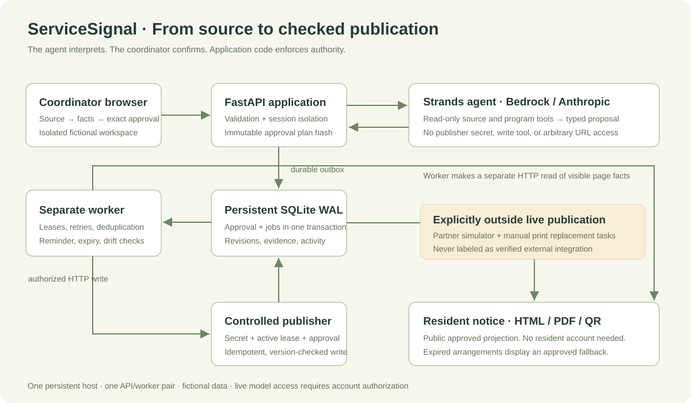
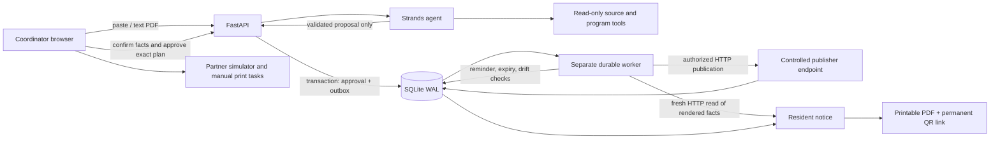

# Architecture

## Authority boundaries

The model interprets a source using two read-only tools and emits a structured proposal. It has no publish tool and never sees the publisher secret. A separate fact-confirmation step records the coordinator's authority. Approval binds the normalized facts, revision, public identifier, destination inventory, destination version, and exact expiration text with a SHA-256 plan hash.

Only a worker with the persistent publisher secret and an active job lease can ask the publisher to execute a specific approved job. The publisher loads the approved data server-side; it does not accept user/model-provided write payloads or target URLs. Approval and jobs are written in one SQLite transaction.

The worker first calls the publisher over HTTP. It then makes a fresh HTTP request for the resident page and parses visible `data-fact` spans. It compares every required field to independently reconstructed approved facts. An HTTP success status alone cannot mark a destination verified.

## Persistence and recovery

API and worker use separate database connections and can restart independently. SQLite WAL, `BEGIN IMMEDIATE`, a busy timeout, and 45-second worker leases serialize writes and recover abandoned claims. The publisher's action key prevents duplicate writes if the worker dies after publication. Retryable failures back off at 15 seconds, 60 seconds, and 5 minutes; authentication/version/mismatch failures require an owner.

At expiry, the worker prioritizes the approved fallback and cancels remaining initial-publication, reminder, and monitoring jobs. Old jobs cannot publish after supersession. A new change replaces the entire active notice only after explicit coordinator acknowledgment. This intentionally avoids pretending to support concurrent overlapping change plans.

After successful initial publication, a recurring read-only verification job runs every 15 minutes. Drift stops verification and requests owner review; it does not automatically overwrite newer content. No additional model call is needed to compare known fields.

Each workspace's fictional clock begins September 13, 2026 and advances from a stored offset, keeping the fixed scenario replayable during judging. Session lifetime, worker leases, and network timeouts use real time; program approval, due jobs, and expiration use the isolated demo clock.

## Deployment boundary

This prototype runs one API and one worker on a persistent host, sharing the same SQLite file. The publisher is a distinct HTTP authorization boundary in the same API process. It is not represented as an independently hosted third-party system. Partner listing state is a labeled simulator record; its publication is not called independent live verification.

## Differences from the planning PRD

The runnable implementation chooses plain JavaScript instead of React, SQLite instead of PostgreSQL, and generated in-memory PDFs instead of S3 assets. One program and four surfaces keep the complete flow demonstrable. Text-based PDFs are now preserved privately and extracted in a resource-limited subprocess. Arbitrary crawls, reviewed translations, and external directory writes are absent. The README is the source of truth for implemented scope; the PRD remains a record of the larger proposal.

## Program scope and resident expiry safeguard

Program setup validates IANA timezones, same-day hours, recurring weekdays, and public contact instructions. Program details lock after the first draft. Intake snapshots the current context under the same database write transaction that creates the change; concurrent setup cannot make the agent interpret stale program context. Review enforces the configured name, timezone, and weekdays. Daylight-saving gaps and repeated hours are rejected for explicit clarification.

The published payload includes program/organization/contact context. Read-back compares the resident-visible organization and contact as well as session facts. After the approved final session ends, the resident read path applies the preapproved fallback even if the durable expiry job has not run. It performs no guessed restoration and does not change the worker's verification evidence.

Worker claims record a real-time heartbeat. Readiness fails after 90 seconds without a heartbeat. Program clocks remain fictional; leases, upload limits, subprocess timeouts, and readiness use real time.
